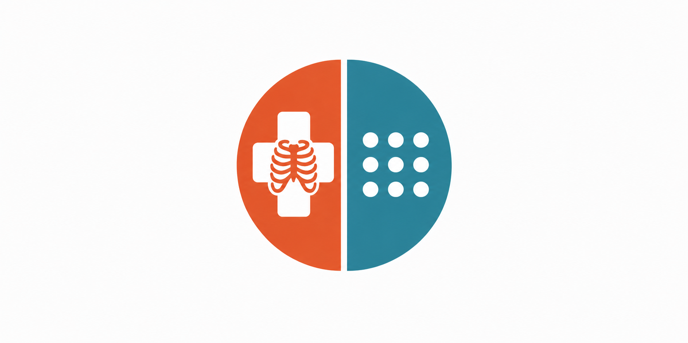

<div align="center">
  
  <h1>Dicom to Ros</h1>
  <p><em>A fully containerized, open-source bridge between medical imaging and robotics.</em></p>

  [](LICENSE)
  [](https://docs.ros.org/en/humble/)
  [](https://www.dicomstandard.org/)
</div>

---

## Overview

Medical imaging relies on **DICOM** (ISO 12052) — the universal standard implemented in hundreds of thousands of imaging devices worldwide. Robotics relies on **ROS 2**. Until now, engineers bridging these two worlds had to manually convert DICOM files to PNGs, JPEGs, or point clouds before running their ROS pipelines, losing spatial metadata and scaling information in the process.

`dicom_to_ros` eliminates that bottleneck. It is a fully distributed, microservice-based ROS 2 pipeline that receives DICOM files over the network and translates them in real-time into standard ROS 2 topics — images, point clouds, video streams, coordinate transforms, and study metadata — with zero manual pre-processing.

This framework is designed to accelerate innovation in **robotic-assisted surgery**, **medical computer vision**, and any research domain where clinical imaging data needs to meet a ROS 2 pipeline.

---

## Features

- **Real-time DICOM ingestion** via standard C-STORE SCP network protocol (no file system polling)
- **2D slice publishing** as `sensor_msgs/Image` + `sensor_msgs/CameraInfo` with correct pixel spacing
- **3D volume streaming** as a live ROS 2 video feed (`sensor_msgs/Image` sequence)
- **Volumetric point cloud** generation from multi-frame DICOM with physically accurate spacing
- **Patient coordinate system → ROS TF tree** mapping, converting DICOM directional cosines to a quaternion transform
- **Study metadata** republished as structured `StudyInfo` messages (patient demographics, modality, date, etc.)
- **Timestamp synchronization**: all messages from a single DICOM file share the same `header.stamp`, enabling exact `message_filters::TimeSynchronizer` alignment
- **Fully containerized**: plug-and-play Docker Compose setup with RViz2 visualization included

---

## Repository Structure

```
dicom_to_ros/
├── dicom_interfaces/          # Custom ROS 2 message definitions
│   └── msg/
│       ├── Dicom.msg          # Central internal message (metadata + pixel data)
│       └── StudyInfo.msg      # Patient and study metadata subset
├── dicom_to_ros/              # Core ROS 2 package — 6 microservice nodes
│   └── dicom_to_ros/
│       ├── dicom_server.py    # DICOM SCP listener (entry point)
│       ├── dicom_2_img.py     # 2D image publisher
│       ├── dicom_2_video.py   # 3D volume → video stream publisher
│       ├── dicom_2_pcl.py     # Point cloud publisher
│       ├── dicom_2_tf.py      # TF transform publisher
│       ├── dicom_2_study_info.py  # Study metadata publisher
│       └── dicom_utils.py     # Shared utilities
├── dicom_to_ros_demo/         # Docker-based demo environment
│   ├── docker/
│   │   ├── docker-compose.yml
│   │   ├── Dockerfile.bridge
│   │   └── Dockerfile.downloader
│   ├── rviz_config/           # Pre-configured RViz2 layout
│   └── test_data_utils/
│       └── download_samples.py
└── doc/
    └── dicom_to_ros.png
```

---

## Architecture

The pipeline uses a fan-out microservice architecture. A single `dicom_server` node acts as the DICOM network listener and publishes a comprehensive internal `Dicom` message. All downstream nodes subscribe independently to that topic and produce their specialized ROS 2 output.

```
DICOM Client (storescu)
        │  C-STORE (port 11112)
        ▼
┌───────────────┐
│ dicom_server  │──── /dicom_interfaces/Dicom ────┬────────────────────┬──────────────────┬──────────────────┬──────────────────┐
└───────────────┘                                 │                    │                  │                  │                  │
                                          ┌───────────────┐  ┌────────────────┐  ┌──────────────┐  ┌────────────────┐  ┌──────────────┐
                                          │dicom2studyinfo│  │  dicom2img     │  │ dicom2video  │  │  dicom2pcl     │  │  dicom2tf    │
                                          └───────┬───────┘  └───────┬────────┘  └──────┬───────┘  └───────┬────────┘  └──────┬───────┘
                                                  │                  │                  │                  │                  │
                                          /dicom_study_info  /dicom_image        /dicom_video_frames /dicom_point_cloud       /tf
                                                             /dicom_camera_info  /dicom_video_camera_info
```

### Nodes

| Node | Description |
| :--- | :--- |
| `dicom_server` | DICOM Storage SCP. Receives C-STORE requests, parses the file, and publishes the central `dicom_interfaces/Dicom` message. |
| `dicom2studyinfo` | Extracts patient demographics and study metadata; republishes as `dicom_interfaces/StudyInfo`. |
| `dicom2img` | Handles single-frame (2D) scans. Publishes a normalized grayscale `sensor_msgs/Image` and `sensor_msgs/CameraInfo`. |
| `dicom2video` | Handles multi-frame (3D) volumes. Streams slices as a `sensor_msgs/Image` sequence alongside `sensor_msgs/CameraInfo`. |
| `dicom2pcl` | Generates a `sensor_msgs/PointCloud2` from volumetric data using pixel spacing, slice thickness, and intensity thresholding. |
| `dicom2tf` | Reads Image Position/Orientation (Patient) DICOM tags. Converts directional cosines to a quaternion and broadcasts the `patient_frame` → `dicom_optical_frame` transform via `/tf`. |

### Published Topics

| Topic | Type | Publisher | Description |
| :--- | :--- | :--- | :--- |
| `/dicom_interfaces/Dicom` | `dicom_interfaces/Dicom` | `dicom_server` | Central internal message: parsed metadata + raw pixel data. |
| `/dicom_study_info` | `dicom_interfaces/StudyInfo` | `dicom2studyinfo` | Patient ID, name, modality, date, series description. |
| `/dicom_image` | `sensor_msgs/Image` | `dicom2img` | 2D image normalized to 8-bit grayscale. |
| `/dicom_camera_info` | `sensor_msgs/CameraInfo` | `dicom2img` | Camera intrinsics for `/dicom_image`. |
| `/dicom_video_frames` | `sensor_msgs/Image` | `dicom2video` | Per-slice video stream from a 3D volume. |
| `/dicom_video_camera_info` | `sensor_msgs/CameraInfo` | `dicom2video` | Camera intrinsics for `/dicom_video_frames`. |
| `/dicom_point_cloud` | `sensor_msgs/PointCloud2` | `dicom2pcl` | 3D point cloud with intensity values from volumetric data. |
| `/tf` | `tf2_msgs/TFMessage` | `dicom2tf` | Patient coordinate system → image frame transform. |

> **Synchronization:** All messages produced from a single DICOM file share the same `header.stamp`, making them compatible with `message_filters::TimeSynchronizer` for exact alignment of spatial, visual, and clinical data.

<!-- ### Image Normalization

DICOM images are typically 12-bit or 16-bit integers. The pipeline normalizes them to `mono8` (uint8) for compatibility with standard ROS 2 computer vision tooling:

$$Pixel_{new} = \frac{(Pixel_{raw} - Pixel_{min})}{(Pixel_{max} - Pixel_{min})} \times 255$$ -->

---

<!-- ## Quick Start (Docker)

### Prerequisites

- [Docker](https://docs.docker.com/get-docker/) and [Docker Compose](https://docs.docker.com/compose/)
- A Linux host with X11 (for RViz2 visualization)

### Run the Demo

```bash
git clone https://github.com/Ekumen-OS/dicom_to_ros.git
cd dicom_to_ros/dicom_to_ros_demo

# Allow X11 connections from Docker
xhost +local:root

# Build and start the full pipeline (DICOM listener + RViz2)
docker compose up --build -d
```

On first run, a `sample_downloader` service automatically downloads and organizes sample DICOM files into `dicom_samples/2D/CT/`, `dicom_samples/3D/MRI/`, etc. The pipeline starts immediately after and listens for DICOM connections on port `11112`.

### Send a DICOM File

Install `dcmtk` on your host machine:

```bash
sudo apt update && sudo apt install dcmtk -y
```

Send any DICOM file to the running pipeline:

```bash
storescu -v 127.0.0.1 11112 -aec ROS_DICOM_AE <path_to_dicom_file>
```

### Verify Output

Exec into the container to inspect the live topics:

```bash
docker exec -it dicom_listener /bin/bash
source /ros2_ws/install/setup.bash

# View study metadata
ros2 topic echo /dicom_study_info

# View all active topics
ros2 topic list
```

View images from the host:

```bash
ros2 run rqt_image_view rqt_image_view
# Select /dicom_image or /dicom_video_frames from the dropdown
```

3D point clouds and TF transforms are visualized automatically in the RViz2 instance launched by Docker Compose.

### DICOM Server Parameters

| Parameter | Default | Description |
| :--- | :--- | :--- |
| `ae_title` | `ROS_DICOM_AE` | DICOM Application Entity Title |
| `port` | `11112` | TCP port for incoming C-STORE connections |

---

## Test Data

The automated downloader fetches small, freely hosted DICOM samples sufficient for functional verification. For high-resolution clinical rendering (detailed head CTs, torso MRIs), manually place DICOM files into `dicom_samples/` from these sources:

- **[OsiriX DICOM Library](https://www.osirix-viewer.com/resources/dicom-image-library/)** — High-resolution 3D volumes (e.g., MANIX head CTA)
- **[The Cancer Imaging Archive (TCIA)](https://www.cancerimagingarchive.net/)** — Large-scale real-world clinical datasets
- **[Siemens MAGNETOM World](https://www.magnetomworld.siemens-healthineers.com/clinical-corner/protocols/dicom-images)** — Clinical-grade MRI from Siemens scanners
- **[DICOM Library](https://www.dicomlibrary.com/)** — Anonymized pathological examples

--- -->

## Contributing

Contributions are welcome. Please read [CONTRIBUTING.md](CONTRIBUTING.md) for the full workflow, code style guidelines, and commit message conventions.

For bugs and feature requests, open an issue on [GitHub](https://github.com/Ekumen-OS/dicom_to_ros/issues). Security vulnerabilities should be reported privately to <security@ekumenlabs.com>.

---

## License

This project is licensed under the **Apache License 2.0**. See [LICENSE](LICENSE) for details.

---

<div align="center">
  <sub>Built with care by <a href="https://ekumenlabs.com">Ekumen Labs</a></sub>
</div>
